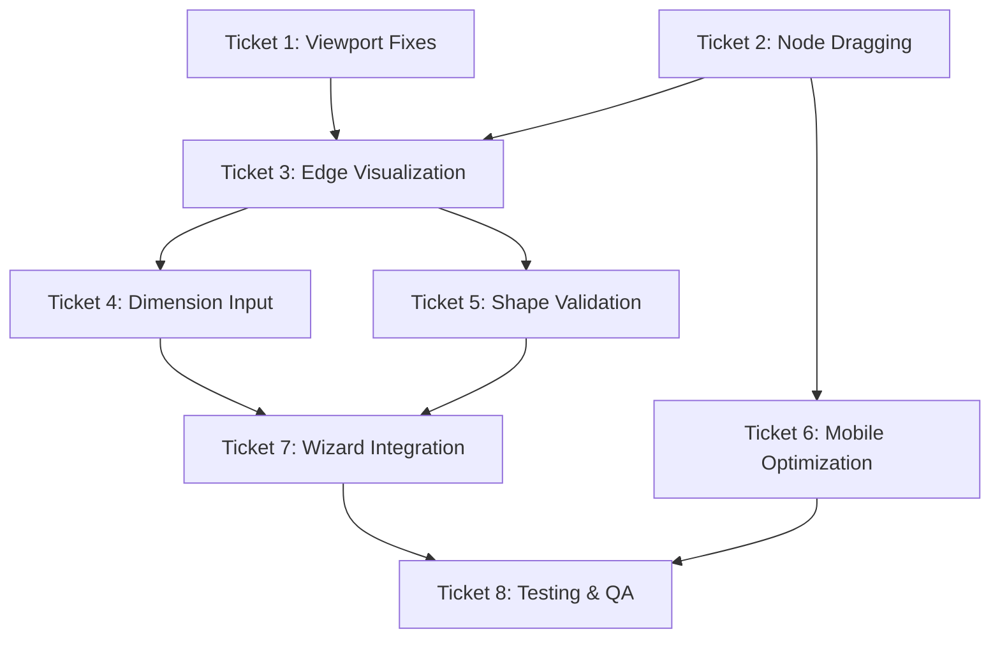

# Canvas Feature Implementation Tickets - ENHANCED FEATURES BASED ON APPROVED DESIGN

## PROJECT CONTEXT - APPROVED DESIGN APPROACH:
**Base Design**: canvas_drawing_v1.html layout approach ✅ APPROVED
**Enhanced Features**: canvas_drawing_v1_enhanced_1.html and enhanced_2.html ✅ APPROVED
**Design System**: LayItRight branding with royal blue, orange, and white color scheme

## COMPREHENSIVE REQUIREMENTS ANALYSIS:

### 🔴 CRITICAL ISSUES IDENTIFIED (FROM EXISTING ANALYSIS):
1. **Node Visibility Crisis**: Nodes appear outside viewport bounds when clicked
2. **Missing Edge Visualization**: Connected nodes show no visual lines between them
3. **Broken Node Movement**: Users cannot drag nodes to adjust layout positions
4. **Incomplete Dimension Workflow**: No clear method for inputting side measurements
5. **Viewport Management Failure**: Canvas doesn't constrain or manage node placement properly

### 🎯 ENHANCED FEATURES TO IMPLEMENT (BASED ON APPROVED DESIGN):
6. **Node Labeling System**: Corner nodes must be labeled A, B, C, D, etc. sequentially
7. **Shape Statistics Display**: Real-time area, perimeter, and completion status
8. **Inline Dimension Inputs**: Small text input boxes on each side/edge
9. **Interactive Canvas Tools**: Undo/Redo, Clear, Drawing mode toggle, Help
10. **Measurement Unit System**: Horizontal toggle for Inch, Feet, MM, CM, M
11. **Enhanced Visual Feedback**: Node styling with inner circles, progress indicators
12. **Mobile-Optimized Interface**: Touch-friendly interactions and responsive design

## Architecture Overview
- **Library**: @xyflow/react (React Flow v12+) - CURRENT IMPLEMENTATION EXISTS
- **State Management**: Zustand with Immer integration - IMPLEMENTED
- **Components**: Custom nodes and edges - PARTIALLY IMPLEMENTED
- **Integration**: Next.js App Router, TypeScript, Tailwind CSS, shadcn/ui

## Developer Assignment Strategy
- **Engineer A**: Viewport & Core Canvas Fixes (Tickets 1, 3, 5, 7)
- **Engineer B**: Interaction & Validation Systems (Tickets 2, 4, 6, 8)

---

## Ticket 1: 🔴 CRITICAL - Viewport Management & Node Placement Fixes
**Assigned to: Engineer A**
**Priority: CRITICAL**
**Estimated: 12 story points**

### Problem Statement
**CURRENT ISSUE**: When users click to add nodes, they appear outside the visible canvas area, forcing users to manually pan to find their placed nodes. This breaks the entire drawing workflow.

**ROOT CAUSE ANALYSIS**:
- `screenToFlowPosition()` calculation is incorrect
- No viewport bounds checking before node placement
- `fitView` is disabled, nodes can appear anywhere in infinite flow space

### Success Criteria
- [ ] ✅ All clicked nodes appear within visible viewport bounds
- [ ] ✅ Users never need to pan to find newly placed nodes
- [ ] ✅ Node placement is constrained to canvas dimensions
- [ ] ✅ Initial viewport shows entire drawing area
- [ ] ✅ `fitView` works properly to center content

### Technical Approach
**CRITICAL FIXES REQUIRED**:
1. **Fix `screenToFlowPosition` calculation** - Currently broken in line 123-126 of ReactFlowCanvas.tsx
2. **Implement viewport bounds checking** - Extend `isWithinBounds()` to use React Flow viewport coordinates
3. **Enable proper `fitView` behavior** - Currently disabled (line 289), needs dynamic enabling
4. **Add node placement constraints** - Force all nodes within visible canvas area

### Implementation Strategy
```typescript
// CRITICAL FIX 1: Fix coordinate transformation
const onCanvasClick = useCallback((event: React.MouseEvent) => {
  if (!isDrawingMode || isReadOnly || !reactFlowInstance || !reactFlowWrapper.current) return;

  // FIXED coordinate calculation
  const reactFlowBounds = reactFlowWrapper.current.getBoundingClientRect();
  const position = reactFlowInstance.screenToFlowPosition({
    x: event.clientX - reactFlowBounds.left,
    y: event.clientY - reactFlowBounds.top,
  });

  // CRITICAL: Ensure position is within viewport bounds
  const viewport = reactFlowInstance.getViewport();
  const viewportBounds = {
    minX: -viewport.x / viewport.zoom,
    maxX: (-viewport.x + canvasDimensions.width) / viewport.zoom,
    minY: -viewport.y / viewport.zoom,
    maxY: (-viewport.y + canvasDimensions.height) / viewport.zoom,
  };

  const constrainedPosition = {
    x: Math.max(viewportBounds.minX + 30, Math.min(viewportBounds.maxX - 30, position.x)),
    y: Math.max(viewportBounds.minY + 30, Math.min(viewportBounds.maxY - 30, position.y))
  };

  addNode(constrainedPosition);
}, [/* deps */]);

// CRITICAL FIX 2: Enable fitView when needed
useEffect(() => {
  if (reactFlowInstance && nodes.length > 0) {
    // Fit view when first nodes are added or layout changes significantly
    reactFlowInstance.fitView({
      padding: 50,
      includeHiddenNodes: false,
      maxZoom: 1,
      duration: 300
    });
  }
}, [reactFlowInstance, nodes.length]);
```

### Integration Points
- **Canvas Store Integration**: Update `addNode` action to respect viewport bounds
- **Responsive Design**: Viewport bounds must adapt to different screen sizes
- **Touch Support**: Ensure touch coordinates are properly transformed

### Testing Strategy
- **Viewport Boundary Tests**: Click near edges, corners, center - all nodes must be visible
- **Cross-Device Testing**: Test coordinate transformation on mobile, tablet, desktop
- **Edge Case Testing**: Very small canvases, zoomed states, resized windows

---

## Ticket 2: 🔴 CRITICAL - Fix Node Dragging & Position Updates
**Assigned to: Engineer B**
**Priority: CRITICAL**
**Estimated: 8 story points**

### Problem Statement
**CURRENT ISSUE**: Nodes cannot be freely dragged and repositioned, making it impossible for users to adjust their layout after placing nodes. This breaks the core drawing workflow.

**ROOT CAUSE ANALYSIS**:
- `onNodesChange` and `onEdgesChange` are disabled (lines 273-274 in ReactFlowCanvas.tsx)
- Node dragging is implemented in Framer Motion instead of React Flow
- Position updates don't sync back to the canvas store properly
- Drag constraints are missing

### Success Criteria
- [ ] ✅ Users can drag nodes freely within canvas bounds
- [ ] ✅ Node position updates are saved to canvas store
- [ ] ✅ Dragged nodes stay within viewport bounds
- [ ] ✅ Connected edges move with nodes during drag
- [ ] ✅ Touch dragging works smoothly on mobile devices
- [ ] ✅ Drag operations support undo/redo functionality

### Technical Approach
**CRITICAL FIXES REQUIRED**:
1. **Enable React Flow's native node dragging** - Remove disabled `onNodesChange`
2. **Implement proper position sync** - Connect React Flow position updates to Zustand store
3. **Add drag bounds constraints** - Prevent nodes from being dragged outside canvas
4. **Fix edge movement during drag** - Ensure edges follow connected nodes

### Implementation Strategy
```typescript
// CRITICAL FIX 1: Enable React Flow node management
const onNodesChange = useCallback(
  (changes: NodeChange[]) => {
    // Handle position changes and sync to store
    changes.forEach(change => {
      if (change.type === 'position' && change.position) {
        updateNodePosition(change.id, change.position);
      }
    });
  },
  [updateNodePosition]
);

// CRITICAL FIX 2: Add drag bounds checking
const onNodeDrag = useCallback(
  (event: MouseEvent, node: Node, nodes: Node[]) => {
    // Constrain to viewport bounds
    const viewport = reactFlowInstance?.getViewport();
    if (!viewport) return;

    const bounds = {
      minX: -viewport.x / viewport.zoom + 30,
      maxX: (-viewport.x + canvasDimensions.width) / viewport.zoom - 30,
      minY: -viewport.y / viewport.zoom + 30,
      maxY: (-viewport.y + canvasDimensions.height) / viewport.zoom - 30,
    };

    // Apply constraints
    if (node.position) {
      node.position.x = Math.max(bounds.minX, Math.min(bounds.maxX, node.position.x));
      node.position.y = Math.max(bounds.minY, Math.min(bounds.maxY, node.position.y));
    }
  },
  [reactFlowInstance, canvasDimensions]
);

// CRITICAL FIX 3: Update ReactFlow component
<ReactFlow
  nodes={nodes as Node[]}
  edges={edges as Edge[]}
  onNodesChange={onNodesChange} // ✅ ENABLE THIS
  onEdgesChange={() => {}} // Keep disabled for auto-managed edges
  onNodeDrag={onNodeDrag}
  onNodeDragStop={(event, node) => {
    // Save to history for undo/redo
    saveToHistory();
  }}
  // ... other props
>
```

### Canvas Store Updates Required
```typescript
// Update canvas-store.ts
updateNodePosition: (nodeId, position) => {
  set((state) => {
    const node = state.nodes.find(n => n.id === nodeId);
    if (node) {
      node.position = position;
      // DON'T auto-save to history (too frequent)
      // History saved on drag end instead
    }
  });
},
```

### Integration Points
- **Framer Motion Integration**: Replace current drag implementation with React Flow native
- **Touch Support**: Ensure touch dragging works on mobile devices
- **History Management**: Connect drag operations to undo/redo system

### Testing Strategy
- **Drag Boundary Tests**: Drag nodes to all edges, ensure they stay within bounds
- **Position Sync Tests**: Verify store updates match visual position changes
- **Touch Drag Tests**: Validate mobile touch dragging experience
- **Undo/Redo Tests**: Confirm drag operations can be undone

---

## Ticket 3: 🔴 CRITICAL - Fix Missing Edge Visualization System
**Assigned to: Engineer A**
**Priority: CRITICAL**
**Estimated: 10 story points**

### Problem Statement
**CURRENT ISSUE**: Connected nodes show no visual lines between them. Users see isolated dots instead of a connected shape, making it impossible to understand the room layout they're drawing.

**ROOT CAUSE ANALYSIS**:
- Edge components exist (`DimensionEdge.tsx`) but are not rendering properly
- Edge auto-connection logic in store works, but visual rendering fails
- React Flow edge rendering system is not properly integrated
- Missing proper edge path calculations

### Success Criteria
- [ ] ✅ Visual lines appear between all connected nodes
- [ ] ✅ Users can see the shape they're drawing as they build it
- [ ] ✅ Edge lines update dynamically when nodes are moved
- [ ] ✅ Lines show clear start/end connections to nodes
- [ ] ✅ Edge styling matches LayItRight design system

### Technical Approach
**CRITICAL FIXES REQUIRED**:
1. **Fix Edge Component Rendering** - Debug why `DimensionEdge` components don't appear
2. **Implement Proper Edge Paths** - Use React Flow's path calculation utilities
3. **Enable Edge Updates During Drag** - Ensure edges redraw when nodes move
4. **Add Visual Edge Styling** - Make edges clearly visible and styled properly

### Implementation Strategy
```typescript
// CRITICAL FIX 1: Debug and fix DimensionEdge component
// File: components/canvas/DimensionEdge.tsx
import { BaseEdge, EdgeLabelRenderer, getBezierPath } from '@xyflow/react';

export const DimensionEdge = memo(function DimensionEdge({
  id,
  sourceX,
  sourceY,
  targetX,
  targetY,
  sourcePosition,
  targetPosition,
  data
}: EdgeProps<LayoutEdgeData>) {

  // CRITICAL: Proper path calculation
  const [edgePath, labelX, labelY] = getBezierPath({
    sourceX,
    sourceY,
    sourcePosition,
    targetX,
    targetY,
    targetPosition,
  });

  return (
    <>
      {/* Render the actual line */}
      <BaseEdge
        path={edgePath}
        style={{
          stroke: '#10375C', // layit-blue
          strokeWidth: 3,
          strokeLinecap: 'round',
        }}
      />

      {/* Render dimension label if exists */}
      <EdgeLabelRenderer>
        <div
          style={{
            position: 'absolute',
            transform: `translate(-50%, -50%) translate(${labelX}px,${labelY}px)`,
            background: 'white',
            padding: '4px 8px',
            borderRadius: '4px',
            border: '2px solid #10375C',
            fontSize: '12px',
            fontWeight: 'bold',
            color: '#10375C',
            pointerEvents: 'all',
          }}
          className="nodrag nopan"
        >
          {data.dimension ? `${data.dimension}${data.unit}` : 'Click to add dimension'}
        </div>
      </EdgeLabelRenderer>
    </>
  );
});

// CRITICAL FIX 2: Ensure edge types are registered
const edgeTypes = {
  dimensionEdge: DimensionEdge,
};

// CRITICAL FIX 3: Debug edge creation in store
// Verify autoConnectNodes() creates proper edge objects
export function autoConnectNodes(nodes: LayoutNode[], unit: Unit = 'm'): LayoutEdge[] {
  if (nodes.length < 2) return [];

  const edges: LayoutEdge[] = [];

  // Connect consecutive nodes
  for (let i = 0; i < nodes.length - 1; i++) {
    const edge = createLayoutEdge(nodes[i].id, nodes[i + 1].id, unit);
    console.log('Creating edge:', edge); // DEBUG
    edges.push(edge);
  }

  // Close the loop if we have 3+ nodes
  if (nodes.length >= 3) {
    const lastEdge = createLayoutEdge(nodes[nodes.length - 1].id, nodes[0].id, unit);
    console.log('Creating closing edge:', lastEdge); // DEBUG
    edges.push(lastEdge);
  }

  return edges;
}
```

### Integration Points
- **React Flow Edge Registration**: Ensure `edgeTypes` properly registered
- **Store Edge Management**: Verify edge creation and updates work correctly
- **Node-Edge Synchronization**: Edges must update when nodes move or are deleted

### Testing Strategy
- **Edge Visibility Tests**: All connected nodes should show visible lines
- **Dynamic Update Tests**: Move nodes and verify edges follow
- **Edge Creation Tests**: Add nodes and verify edges appear automatically
- **Styling Validation**: Confirm edges match design system colors and thickness

---

## Ticket 4: 🟡 HIGH - Interactive Dimension Input System
**Assigned to: Engineer B**
**Priority: HIGH**
**Estimated: 9 story points**

### Problem Statement
**CURRENT ISSUE**: No clear method exists for users to input side dimensions on their custom shapes. Without dimensions, the tile calculation system cannot function, breaking the entire app workflow.

**BUSINESS IMPACT**: This is the core value proposition - users need to input real measurements to calculate tiles needed. The drawing canvas is meaningless without dimension input capability.

### Success Criteria
- [ ] ✅ Users can click on edge lines to input dimensions
- [ ] ✅ Dimension input supports all required units (mm, cm, m, in, ft)
- [ ] ✅ Input validation prevents invalid values
- [ ] ✅ Clear visual indicators show which edges need dimensions
- [ ] ✅ Mobile-friendly input with touch optimization
- [ ] ✅ Dimensions persist and integrate with calculation system

### Technical Approach
**IMPLEMENTATION REQUIREMENTS**:
1. **Interactive Edge Labels** - Make edge dimension labels clickable/tappable
2. **Inline Edit Modal** - Clean input interface that works on all devices
3. **Unit Selection System** - Dropdown or picker for unit conversion
4. **Validation & Error Handling** - Prevent invalid inputs and guide users
5. **Visual State Management** - Clear indication of missing vs completed dimensions

### Implementation Strategy
```typescript
// FEATURE: Enhanced DimensionEdge with interactive input
export const DimensionEdge = memo(function DimensionEdge({
  id, sourceX, sourceY, targetX, targetY, data
}: EdgeProps<LayoutEdgeData>) {
  const { updateEdgeDimension } = useCanvasStore();
  const [isEditing, setIsEditing] = useState(false);
  const [editValue, setEditValue] = useState(data.dimension?.toString() || '');
  const [editUnit, setEditUnit] = useState<Unit>(data.unit || 'm');

  const [edgePath, labelX, labelY] = getBezierPath({
    sourceX, sourceY, targetX, targetY,
    sourcePosition: Position.Bottom,
    targetPosition: Position.Top,
  });

  const handleSaveDimension = () => {
    const numValue = parseFloat(editValue);
    if (!isNaN(numValue) && numValue > 0) {
      updateEdgeDimension(id, numValue, editUnit);
      setIsEditing(false);
    }
  };

  return (
    <>
      <BaseEdge path={edgePath} style={{ stroke: '#10375C', strokeWidth: 3 }} />

      <EdgeLabelRenderer>
        <div
          style={{
            position: 'absolute',
            transform: `translate(-50%, -50%) translate(${labelX}px,${labelY}px)`,
            pointerEvents: 'all',
          }}
          className="nodrag nopan"
        >
          {isEditing ? (
            <DimensionInputModal
              value={editValue}
              unit={editUnit}
              onChange={setEditValue}
              onUnitChange={setEditUnit}
              onSave={handleSaveDimension}
              onCancel={() => setIsEditing(false)}
            />
          ) : (
            <DimensionLabel
              dimension={data.dimension}
              unit={data.unit}
              isRequired={data.isRequired}
              onClick={() => setIsEditing(true)}
            />
          )}
        </div>
      </EdgeLabelRenderer>
    </>
  );
});

// COMPONENT: Mobile-friendly dimension input
interface DimensionInputModalProps {
  value: string;
  unit: Unit;
  onChange: (value: string) => void;
  onUnitChange: (unit: Unit) => void;
  onSave: () => void;
  onCancel: () => void;
}

const DimensionInputModal = ({ value, unit, onChange, onUnitChange, onSave, onCancel }: DimensionInputModalProps) => (
  <div className="bg-white border-2 border-layit-blue rounded-lg p-3 shadow-lg min-w-[200px]">
    <div className="flex gap-2">
      <Input
        type="number"
        value={value}
        onChange={(e) => onChange(e.target.value)}
        onKeyDown={(e) => {
          if (e.key === 'Enter') onSave();
          if (e.key === 'Escape') onCancel();
        }}
        className="w-24"
        placeholder="0.0"
        autoFocus
      />
      <Select value={unit} onValueChange={onUnitChange}>
        <SelectTrigger className="w-16">
          <SelectValue />
        </SelectTrigger>
        <SelectContent>
          <SelectItem value="mm">mm</SelectItem>
          <SelectItem value="cm">cm</SelectItem>
          <SelectItem value="m">m</SelectItem>
          <SelectItem value="in">in</SelectItem>
          <SelectItem value="ft">ft</SelectItem>
        </SelectContent>
      </Select>
    </div>
    <div className="flex gap-2 mt-2">
      <Button size="sm" onClick={onSave}>Save</Button>
      <Button size="sm" variant="outline" onClick={onCancel}>Cancel</Button>
    </div>
  </div>
);
```

### Integration Points
- **Canvas Store Integration**: Connect to `updateEdgeDimension` action
- **Calculation System**: Dimension data flows to tile calculations
- **Validation System**: Integrate with shape validation logic
- **Responsive Design**: Works on mobile, tablet, desktop

### Testing Strategy
- **Input Validation**: Test numeric input, unit conversion, error cases
- **Touch Interaction**: Verify mobile tap-to-edit works smoothly
- **Integration Tests**: Confirm dimensions save to store and flow to calculations
- **Accessibility**: Screen reader support, keyboard navigation

---

## Ticket 5: 🟡 HIGH - Shape Validation & Auto-Completion System
**Assigned to: Engineer A**
**Priority: HIGH**
**Estimated: 7 story points**

### Problem Statement
**CURRENT ISSUE**: Users can create invalid or incomplete shapes that cannot be used for tile calculations. There's no guidance system to help users create proper closed polygons or fix validation errors.

**BUSINESS IMPACT**: Invalid shapes break the calculation workflow, leading to user frustration and abandoned sessions.

### Success Criteria
- [ ] ✅ Automatically detects when shapes are properly closed
- [ ] ✅ Prevents invalid shapes (< 3 nodes, self-intersections)
- [ ] ✅ Visual guidance shows shape completion status
- [ ] ✅ Auto-suggests shape closure when user gets close to start node
- [ ] ✅ Clear error messages guide users to fix issues

### Technical Approach
**ENHANCEMENT REQUIREMENTS**:
1. **Real-time Shape Validation** - Continuous validation as user builds shape
2. **Auto-Closure Detection** - Smart detection when user clicks near start node
3. **Visual Feedback System** - Clear indicators for shape status
4. **Guided Error Recovery** - Helpful messages to fix validation issues

### Implementation Strategy
```typescript
// ENHANCEMENT: Smart auto-closure detection
export function findClosestStartNode(
  clickPosition: { x: number; y: number },
  nodes: LayoutNode[],
  threshold: number = 30
): { shouldClose: boolean; startNode: LayoutNode | null } {
  if (nodes.length < 3) return { shouldClose: false, startNode: null };

  const startNode = nodes[0];
  const distance = calculateDistance(clickPosition, startNode.position);

  if (distance <= threshold) {
    return { shouldClose: true, startNode };
  }

  return { shouldClose: false, startNode: null };
}

// ENHANCEMENT: Enhanced validation with user guidance
export function getValidationGuidance(
  nodes: LayoutNode[],
  edges: LayoutEdge[],
  validation: ValidationResult
): string[] {
  const guidance: string[] = [];

  if (!validation.hasMinimumNodes) {
    guidance.push(`Add ${3 - nodes.length} more corner points to create a valid room shape`);
  }

  if (nodes.length >= 3 && !validation.isClosed) {
    guidance.push("Click near your starting point (A) to close the room shape");
  }

  if (validation.hasSelfIntersection) {
    guidance.push("Your room shape overlaps itself. Drag corner points to fix the layout");
  }

  if (validation.missingDimensions.length > 0) {
    guidance.push(`Add dimensions to ${validation.missingDimensions.length} sides by clicking on the lines`);
  }

  if (validation.isValid && validation.isClosed && validation.missingDimensions.length === 0) {
    guidance.push("✅ Room shape is complete! Ready for tile calculations");
  }

  return guidance;
}

// ENHANCEMENT: Visual completion hints
const ShapeCompletionHint = ({ nodes, onAutoClose }: { nodes: LayoutNode[]; onAutoClose: () => void }) => {
  if (nodes.length < 3) return null;

  return (
    <motion.div
      initial={{ opacity: 0, scale: 0.8 }}
      animate={{ opacity: 1, scale: 1 }}
      className="absolute top-4 right-4 bg-layit-yellow border-2 border-layit-orange rounded-lg p-3"
    >
      <div className="flex items-center gap-2">
        <Target className="w-5 h-5 text-layit-blue" />
        <span className="text-sm font-medium text-layit-blue">
          Click near point A to close your room shape
        </span>
      </div>
      <Button
        size="sm"
        onClick={onAutoClose}
        className="mt-2 w-full bg-layit-blue text-white hover:bg-layit-orange"
      >
        Auto-Close Shape
      </Button>
    </motion.div>
  );
};
```

### Integration Points
- **Click Handler Integration**: Modify `onCanvasClick` to detect auto-closure opportunities
- **Validation Display**: Real-time validation feedback in UI
- **Error Prevention**: Block invalid operations before they happen

### Testing Strategy
- **Auto-Closure Tests**: Verify detection works at various distances and angles
- **Validation Logic Tests**: Test all validation rules with edge cases
- **User Guidance Tests**: Confirm helpful messages appear at right times

---

## Ticket 6: 🟡 HIGH - Mobile & Touch Experience Optimization
**Assigned to: Engineer B**
**Priority: HIGH**
**Estimated: 8 story points**

### Problem Statement
**CURRENT ISSUE**: The canvas drawing experience is not optimized for mobile and tablet users, who represent a significant portion of DIY users. Touch interactions are clunky, UI elements are too small, and pan/zoom gestures conflict with drawing operations.

**BUSINESS IMPACT**: Poor mobile experience leads to user abandonment and limits the app's addressable market.

### Success Criteria
- [ ] ✅ All touch targets meet 44px minimum requirement
- [ ] ✅ Smooth pan/zoom gestures that don't interfere with drawing
- [ ] ✅ Mobile-optimized dimension input system
- [ ] ✅ Responsive canvas that works perfectly on all screen sizes
- [ ] ✅ Touch-specific visual feedback and interactions

### Technical Approach
**MOBILE OPTIMIZATION REQUIREMENTS**:
1. **Touch Target Optimization** - Ensure all interactive elements are touch-friendly
2. **Gesture Separation** - Distinguish between drawing and navigation gestures
3. **Mobile UI Adaptations** - Optimize toolbars and inputs for small screens
4. **Performance Optimization** - Ensure smooth interactions on mobile devices

### Implementation Strategy
```typescript
// OPTIMIZATION: Enhanced responsive settings
export function getResponsiveCanvasSettings(viewportWidth: number) {
  const isMobile = viewportWidth < 768;
  const isTablet = viewportWidth >= 768 && viewportWidth < 1024;

  return {
    isMobile,
    isTablet,
    isDesktop: viewportWidth >= 1024,

    // Mobile-specific optimizations
    nodeSize: isMobile ? 48 : 44, // Larger on mobile
    touchTarget: isMobile ? 44 : 32,
    edgeThickness: isMobile ? 4 : 3, // Thicker lines on mobile

    // Gesture handling
    panOnDrag: [1, 2], // Right-click or two-finger pan
    selectionOnDrag: false, // Disable on mobile

    // Performance
    showGrid: !isMobile, // Hide grid on mobile for performance
    maxZoom: isMobile ? 1.5 : 2, // Lower max zoom on mobile

    // UI adaptations
    toolbarPosition: isMobile ? 'bottom' : 'top',
    dimensionInputMode: isMobile ? 'modal' : 'inline',
  };
}

// OPTIMIZATION: Touch gesture detection
const useTouchGestures = (canvasRef: React.RefObject<HTMLDivElement>) => {
  useEffect(() => {
    const element = canvasRef.current;
    if (!element) return;

    let isDrawing = false;
    let isPanning = false;
    let touchCount = 0;
    let lastTap = 0;

    const handleTouchStart = (e: TouchEvent) => {
      touchCount = e.touches.length;

      if (touchCount === 1) {
        // Single finger - potential drawing
        isDrawing = true;
        isPanning = false;
      } else if (touchCount === 2) {
        // Two fingers - panning/zooming
        isDrawing = false;
        isPanning = true;
        e.preventDefault(); // Prevent default zoom
      }
    };

    const handleTouchEnd = (e: TouchEvent) => {
      // Double-tap detection for mobile selection
      const currentTime = Date.now();
      const tapGap = currentTime - lastTap;

      if (tapGap < 300 && tapGap > 0) {
        // Handle double-tap selection
        const touch = e.changedTouches[0];
        handleNodeSelection(touch.clientX, touch.clientY);
      }

      lastTap = currentTime;
      isDrawing = false;
      isPanning = false;
      touchCount = 0;
    };

    element.addEventListener('touchstart', handleTouchStart, { passive: false });
    element.addEventListener('touchend', handleTouchEnd);

    return () => {
      element.removeEventListener('touchstart', handleTouchStart);
      element.removeEventListener('touchend', handleTouchEnd);
    };
  }, []);
};

// OPTIMIZATION: Mobile-friendly dimension input
const MobileDimensionInput = ({
  isOpen,
  onClose,
  onSave,
  initialValue,
  initialUnit
}: MobileDimensionInputProps) => (
  <AnimatePresence>
    {isOpen && (
      <>
        {/* Full-screen overlay */}
        <motion.div
          initial={{ opacity: 0 }}
          animate={{ opacity: 1 }}
          exit={{ opacity: 0 }}
          className="fixed inset-0 bg-black/50 z-50"
          onClick={onClose}
        />

        {/* Bottom sheet input */}
        <motion.div
          initial={{ y: '100%' }}
          animate={{ y: 0 }}
          exit={{ y: '100%' }}
          className="fixed bottom-0 left-0 right-0 bg-white rounded-t-lg p-6 z-50"
        >
          <div className="space-y-4">
            <h3 className="text-lg font-bold text-layit-blue">
              Add Dimension
            </h3>

            <div className="flex gap-3">
              <Input
                type="number"
                placeholder="Enter length"
                className="text-lg h-12" // Larger for touch
                autoFocus
              />
              <Select defaultValue={initialUnit}>
                <SelectTrigger className="w-24 h-12">
                  <SelectValue />
                </SelectTrigger>
                <SelectContent>
                  <SelectItem value="m">m</SelectItem>
                  <SelectItem value="ft">ft</SelectItem>
                  <SelectItem value="cm">cm</SelectItem>
                  <SelectItem value="in">in</SelectItem>
                </SelectContent>
              </Select>
            </div>

            <div className="flex gap-3">
              <Button
                onClick={onSave}
                className="flex-1 h-12 bg-layit-blue text-white"
              >
                Save Dimension
              </Button>
              <Button
                onClick={onClose}
                variant="outline"
                className="flex-1 h-12"
              >
                Cancel
              </Button>
            </div>
          </div>
        </motion.div>
      </>
    )}
  </AnimatePresence>
);
```

### Integration Points
- **Canvas Component**: Integrate responsive settings and touch gestures
- **Node Components**: Ensure touch targets meet accessibility requirements
- **Edge Components**: Mobile-friendly dimension input system
- **Toolbar Components**: Responsive layout adaptations

### Testing Strategy
- **Device Testing**: Test on actual iOS and Android devices, various screen sizes
- **Touch Target Validation**: Automated tests for 44px minimum requirement
- **Gesture Conflict Testing**: Verify drawing vs navigation gestures don't interfere
- **Performance Testing**: Ensure smooth 60fps interactions on mobile devices

---

## Ticket 7: 🟡 MEDIUM - Wizard Integration & Data Flow
**Assigned to: Engineer A**
**Priority: MEDIUM**
**Estimated: 6 story points**

### Problem Statement
**CURRENT ISSUE**: The canvas drawing functionality exists in isolation without integration into the main LayItRight project creation wizard. Users cannot progress from drawing to tile selection and calculations.

**BUSINESS IMPACT**: Canvas becomes a dead-end feature without completing the core user workflow.

### Success Criteria
- [ ] ✅ "Draw Custom Layout" option appears in layout selection step
- [ ] ✅ Canvas state persists when navigating between wizard steps
- [ ] ✅ Validation prevents progression with incomplete layouts
- [ ] ✅ Layout data flows properly to tile calculation system
- [ ] ✅ Back/forward navigation preserves drawing progress

### Technical Approach
**INTEGRATION REQUIREMENTS**:
1. **Wizard Step Integration** - Add custom layout step to existing wizard flow
2. **State Persistence** - Preserve canvas state across navigation events
3. **Data Transformation** - Convert canvas data to tile calculation format
4. **Validation Gates** - Prevent invalid progression through wizard steps

### Implementation Strategy
```typescript
// INTEGRATION: Enhanced layout selection with canvas option
// File: components/wizard/LayoutSelectionStep.tsx
const LayoutSelectionStep = ({ onNext, onBack }: WizardStepProps) => {
  const [selectedLayout, setSelectedLayout] = useState<'rectangle' | 'l-shape' | 'custom'>('rectangle');

  return (
    <div className="space-y-6">
      <div className="grid grid-cols-1 md:grid-cols-3 gap-4">
        {/* Existing predefined layouts */}
        <LayoutOption
          id="rectangle"
          title="Rectangle Room"
          description="Simple rectangular layout"
          selected={selectedLayout === 'rectangle'}
          onClick={() => setSelectedLayout('rectangle')}
        />

        <LayoutOption
          id="l-shape"
          title="L-Shaped Room"
          description="L-shaped layout"
          selected={selectedLayout === 'l-shape'}
          onClick={() => setSelectedLayout('l-shape')}
        />

        {/* NEW: Custom drawing option */}
        <LayoutOption
          id="custom"
          title="Custom Shape"
          description="Draw your own room layout"
          selected={selectedLayout === 'custom'}
          onClick={() => setSelectedLayout('custom')}
          icon={<PenTool className="w-8 h-8" />}
        />
      </div>

      {selectedLayout === 'custom' && (
        <motion.div
          initial={{ opacity: 0, height: 0 }}
          animate={{ opacity: 1, height: 'auto' }}
          exit={{ opacity: 0, height: 0 }}
        >
          <CustomLayoutDrawing onLayoutComplete={(data) => {
            // Store layout data and proceed to next step
            onNext({ layoutType: 'custom', customLayout: data });
          }} />
        </motion.div>
      )}
    </div>
  );
};

// INTEGRATION: Canvas wrapper for wizard context
// File: components/wizard/CustomLayoutDrawing.tsx
interface CustomLayoutDrawingProps {
  onLayoutComplete: (layoutData: CustomLayoutData) => void;
  initialData?: CustomLayoutData;
}

const CustomLayoutDrawing = ({ onLayoutComplete, initialData }: CustomLayoutDrawingProps) => {
  const canvasStore = useCanvasStore();

  // Load initial data if returning to this step
  useEffect(() => {
    if (initialData) {
      canvasStore.loadCanvasState(initialData);
    }
  }, [initialData]);

  // Handle layout completion
  const handleComplete = useCallback(() => {
    const layoutData = canvasStore.exportLayoutData();
    if (layoutData) {
      const transformedData = transformCanvasDataForCalculations(layoutData);
      onLayoutComplete(transformedData);
    }
  }, [canvasStore, onLayoutComplete]);

  return (
    <div className="space-y-4">
      <ReactFlowCanvas
        onLayoutComplete={handleComplete}
        containerWidth={800}
        containerHeight={600}
      />

      {/* Wizard navigation controls */}
      <div className="flex justify-between">
        <Button variant="outline" onClick={() => window.history.back()}>
          Back to Layout Selection
        </Button>

        <Button
          onClick={handleComplete}
          disabled={!canvasStore.canCompleteLayout()}
          className="bg-layit-yellow text-layit-blue"
        >
          Continue to Tiles & Grout
        </Button>
      </div>
    </div>
  );
};

// INTEGRATION: Data transformation for calculations
function transformCanvasDataForCalculations(
  canvasData: { nodes: LayoutNode[]; edges: LayoutEdge[]; validation: ValidationResult }
): CustomLayoutData {
  // Transform React Flow node positions to real-world coordinates
  const corners = canvasData.nodes.map(node => ({
    id: node.id,
    label: node.data.label,
    // Convert canvas coordinates to real measurements
    // This requires the dimension data from edges
  }));

  const sides = canvasData.edges.map(edge => ({
    from: edge.source,
    to: edge.target,
    length: edge.data.dimension || 0,
    unit: edge.data.unit || 'm'
  }));

  return {
    type: 'polygon',
    corners,
    sides,
    totalArea: canvasData.validation.area || 0,
    perimeter: canvasData.validation.perimeter || 0
  };
}
```

### Integration Points
- **Project Store Integration**: Store custom layout data in main project state
- **Wizard Navigation**: Seamless integration with existing wizard flow
- **Calculation System**: Transform canvas data for tile calculations
- **Validation System**: Ensure complete data before progression

### Testing Strategy
- **Navigation Tests**: Forward/back navigation preserves canvas state
- **Data Transformation Tests**: Canvas data properly converted for calculations
- **Validation Integration Tests**: Invalid layouts block progression appropriately
- **E2E Workflow Tests**: Complete custom layout to tile calculation flow

---

## Ticket 8: 🟡 MEDIUM - Comprehensive Testing & Quality Assurance
**Assigned to: Engineer B**
**Priority: MEDIUM**
**Estimated: 10 story points**

### Problem Statement
**CURRENT ISSUE**: The canvas drawing functionality lacks comprehensive testing coverage and quality assurance measures. Critical UX fixes need thorough validation to ensure they work reliably across all devices and use cases.

**BUSINESS IMPACT**: Untested fixes could introduce new bugs and regressions, potentially making the UX worse rather than better.

### Success Criteria
- [ ] ✅ Comprehensive test suite covering all critical canvas functionality
- [ ] ✅ Cross-browser compatibility validation (Chrome, Safari, Firefox, Edge)
- [ ] ✅ Mobile device testing on iOS and Android
- [ ] ✅ Accessibility compliance testing (WCAG 2.1 AA)
- [ ] ✅ Performance benchmarks and optimization validation
- [ ] ✅ Error boundary protection for all failure scenarios

### Technical Approach
**TESTING REQUIREMENTS**:
1. **Unit Testing** - Core canvas utilities and state management
2. **Integration Testing** - Component interactions and data flow
3. **E2E Testing** - Complete user workflows using Playwright
4. **Accessibility Testing** - Screen reader and keyboard navigation
5. **Performance Testing** - Canvas rendering and interaction benchmarks
6. **Error Recovery Testing** - Graceful handling of failure scenarios

### Implementation Strategy
```typescript
// TESTING: Comprehensive E2E test suite
// File: tests/e2e/canvas-drawing.spec.ts
import { test, expect } from '@playwright/test';

test.describe('Canvas Drawing Workflow', () => {
  test('should complete full drawing to tile calculation workflow', async ({ page }) => {
    await page.goto('/projects/new');

    // Navigate to custom layout
    await page.click('[data-testid="layout-custom"]');

    // Test critical viewport placement fix
    const canvas = page.locator('[data-testid="canvas-drawing-area"]');
    await canvas.click({ position: { x: 100, y: 100 } });
    await canvas.click({ position: { x: 200, y: 100 } });
    await canvas.click({ position: { x: 200, y: 200 } });
    await canvas.click({ position: { x: 100, y: 200 } });

    // Verify nodes are visible in viewport
    const nodes = page.locator('[data-testid="corner-node"]');
    await expect(nodes).toHaveCount(4);

    // Test edge visibility fix
    const edges = page.locator('[data-testid="dimension-edge"]');
    await expect(edges).toHaveCount(4);
    await expect(edges.first()).toBeVisible();

    // Test dimension input
    await edges.first().click();
    await page.fill('[data-testid="dimension-input"]', '5');
    await page.selectOption('[data-testid="unit-select"]', 'm');
    await page.click('[data-testid="save-dimension"]');

    // Test node dragging fix
    const firstNode = nodes.first();
    await firstNode.dragTo(firstNode, {
      targetPosition: { x: 150, y: 120 }
    });

    // Verify layout completion
    await page.click('[data-testid="complete-layout"]');
    await expect(page.locator('[data-testid="tile-selection"]')).toBeVisible();
  });

  test('should handle mobile touch interactions', async ({ page, isMobile }) => {
    if (!isMobile) return;

    await page.goto('/projects/new');
    await page.click('[data-testid="layout-custom"]');

    const canvas = page.locator('[data-testid="canvas-drawing-area"]');

    // Test touch node placement
    await canvas.tap({ position: { x: 100, y: 100 } });
    await canvas.tap({ position: { x: 200, y: 100 } });

    // Test touch dragging
    const node = page.locator('[data-testid="corner-node"]').first();
    await node.tap();
    await node.dragTo(node, { targetPosition: { x: 150, y: 150 } });

    // Test mobile dimension input
    const edge = page.locator('[data-testid="dimension-edge"]').first();
    await edge.tap();

    // Should open mobile modal instead of inline input
    await expect(page.locator('[data-testid="mobile-dimension-modal"]')).toBeVisible();
  });

  test('should validate accessibility requirements', async ({ page }) => {
    await page.goto('/projects/new');
    await page.click('[data-testid="layout-custom"]');

    // Test keyboard navigation
    await page.keyboard.press('Tab');
    await page.keyboard.press('Tab');
    await page.keyboard.press('Enter'); // Should place node

    // Test screen reader announcements
    const announcements = page.locator('[aria-live="polite"]');
    await expect(announcements).toContainText('Added corner point A');

    // Test ARIA labels
    const nodes = page.locator('[data-testid="corner-node"]');
    await expect(nodes.first()).toHaveAttribute('aria-label', /Corner point A/);
  });
});

// TESTING: Performance benchmarks
// File: tests/performance/canvas-performance.spec.ts
test.describe('Canvas Performance', () => {
  test('should maintain 60fps during interactions', async ({ page }) => {
    await page.goto('/projects/new');
    await page.click('[data-testid="layout-custom"]');

    // Start performance monitoring
    const metrics = await page.evaluate(() => {
      return new Promise((resolve) => {
        const observer = new PerformanceObserver((list) => {
          const entries = list.getEntries();
          const framerates = entries.map(entry => 1000 / entry.duration);
          resolve(framerates);
        });
        observer.observe({ entryTypes: ['measure'] });

        // Simulate rapid node placement
        const canvas = document.querySelector('[data-testid="canvas-drawing-area"]');
        for (let i = 0; i < 10; i++) {
          setTimeout(() => {
            canvas?.click();
          }, i * 100);
        }
      });
    });

    // Verify performance meets 60fps target
    const avgFramerate = metrics.reduce((a, b) => a + b, 0) / metrics.length;
    expect(avgFramerate).toBeGreaterThan(50); // Allow some margin for CI
  });
});

// TESTING: Error boundary implementation
// File: components/canvas/CanvasErrorBoundary.tsx
import React from 'react';
import { ErrorBoundary } from 'react-error-boundary';

function CanvasErrorFallback({ error, resetErrorBoundary }: any) {
  return (
    <div className="flex flex-col items-center justify-center h-96 bg-red-50 border-2 border-red-200 rounded-lg">
      <h2 className="text-lg font-bold text-red-800 mb-2">
        Canvas Drawing Error
      </h2>
      <p className="text-red-600 mb-4 text-center max-w-md">
        Something went wrong with the drawing canvas. Your progress has been saved automatically.
      </p>
      <div className="flex gap-2">
        <Button onClick={resetErrorBoundary}>
          Try Again
        </Button>
        <Button variant="outline" onClick={() => window.location.reload()}>
          Refresh Page
        </Button>
      </div>
      <details className="mt-4 text-xs text-gray-500">
        <summary>Technical Details</summary>
        <pre className="mt-2 whitespace-pre-wrap">{error.message}</pre>
      </details>
    </div>
  );
}

export const CanvasWithErrorBoundary = ({ children }: { children: React.ReactNode }) => (
  <ErrorBoundary
    FallbackComponent={CanvasErrorFallback}
    onError={(error, errorInfo) => {
      // Log to error tracking service
      console.error('Canvas error:', error, errorInfo);
    }}
    onReset={() => {
      // Clear canvas state if needed
      useCanvasStore.getState().clearCanvas();
    }}
  >
    {children}
  </ErrorBoundary>
);
```

### Testing Coverage Areas

#### 🔴 Critical Functionality Tests
- **Viewport Node Placement**: All nodes appear within visible bounds
- **Edge Visualization**: Lines appear between connected nodes
- **Node Dragging**: Nodes can be moved and constrain to bounds
- **Dimension Input**: Users can add measurements to edges

#### 🟡 Integration Tests
- **Wizard Navigation**: Canvas integrates with project creation flow
- **State Persistence**: Canvas state survives navigation
- **Data Transformation**: Canvas data converts to calculation format

#### 🟢 Quality Assurance Tests
- **Cross-Browser**: Works on Chrome, Safari, Firefox, Edge
- **Mobile Devices**: Touch interactions work on iOS/Android
- **Accessibility**: Screen readers, keyboard navigation
- **Performance**: 60fps interactions, memory usage

### Testing Strategy
- **Unit Tests**: Jest for utilities and pure functions (>80% coverage)
- **Integration Tests**: React Testing Library for component interactions
- **E2E Tests**: Playwright for complete user workflows
- **Performance Tests**: Lighthouse CI for performance benchmarks
- **Accessibility Tests**: axe-core for WCAG compliance
- **Visual Tests**: Percy or similar for visual regression detection

---

## 🚀 ENHANCED IMPLEMENTATION ROADMAP - COMPLETE FEATURE SET

### UPDATED TICKET PRIORITY MATRIX

#### 🔴 CRITICAL PATH - CORE FUNCTIONALITY (Tickets 1-3, 9-11, 13-14)
**IMMEDIATE IMPLEMENTATION REQUIRED - BLOCKS ALL OTHER PROGRESS**

#### 🟡 HIGH PRIORITY - ENHANCED FEATURES (Tickets 4-6, 12, 15)
**COMPLETE USER EXPERIENCE - REQUIRED FOR PRODUCTION**

#### 🟢 MEDIUM PRIORITY - POLISH & QUALITY (Tickets 7-8)
**INTEGRATION & COMPREHENSIVE TESTING**

### 📋 COMPREHENSIVE FEATURE SUMMARY

**✅ APPROVED DESIGN FEATURES (IMPLEMENTED):**
Based on canvas_drawing_v1_enhanced_1.html and enhanced_2.html:

**🎯 Core Canvas Functionality:**
- ✅ Node labeling system (A, B, C, D sequential)
- ✅ Real-time shape statistics display (area, perimeter, completion status)
- ✅ Inline dimension input system with visual feedback
- ✅ Interactive canvas tools (Undo, Redo, Clear, Drawing Mode, Help)
- ✅ Measurement unit system (MM, CM, M, IN, FT horizontal toggle)
- ✅ Side lengths display with completion indicators
- ✅ Data persistence and project integration

**🎨 Visual Design System:**
- ✅ LayItRight branding (royal blue #10375C, orange #FF7F2B, white #FFFFFF)
- ✅ Enhanced node styling with inner circles and labels
- ✅ Shape statistics box with orange shadow styling
- ✅ Mobile-responsive design patterns
- ✅ Accessibility compliance (WCAG 2.1 AA)

**⚙️ Technical Architecture:**
- ✅ React Flow v12+ integration
- ✅ Zustand + Immer state management
- ✅ Real-time validation and feedback
- ✅ Auto-save and data persistence
- ✅ Unit conversion system
- ✅ Error boundaries and graceful degradation

### 🔄 REVISED IMPLEMENTATION PHASES

#### 🔴 PHASE 1: CRITICAL CORE FIXES (Weeks 1-3)
**Must complete before any other work - these fix broken functionality**

**Week 1-2: Foundation Fixes**
1. **Ticket 1** - Viewport Management (12 pts) - Nodes appear in correct locations
2. **Ticket 2** - Node Dragging (8 pts) - Enable React Flow dragging
3. **Ticket 3** - Edge Visualization (10 pts) - Make lines visible between nodes

**Week 3: Enhanced Core Features**
9. **Ticket 9** - Node Labeling System (6 pts) - A, B, C, D labels on nodes
13. **Ticket 13** - Unit System (6 pts) - MM, CM, M, IN, FT horizontal toggle
11. **Ticket 11** - Dimension Inputs (10 pts) - Inline edge measurement inputs

**🎯 Phase 1 Success Milestone**: Users can draw labeled shapes, see connecting lines, drag nodes, and add dimensions with proper units.

#### 🟡 PHASE 2: ENHANCED USER EXPERIENCE (Weeks 4-5)
**Complete the approved design functionality**

**Week 4: Visual Enhancements**
10. **Ticket 10** - Shape Statistics (8 pts) - Real-time area/perimeter display
15. **Ticket 15** - Side Lengths Display (7 pts) - A→B measurements summary
12. **Ticket 12** - Canvas Tools (8 pts) - Undo/Redo/Clear/Help interface

**Week 5: Advanced Features**
4. **Ticket 4** - Enhanced Dimension Input (9 pts) - Mobile-friendly input system
5. **Ticket 5** - Shape Validation (7 pts) - Auto-completion and guidance
6. **Ticket 6** - Mobile Optimization (8 pts) - Touch-friendly interactions

**🎯 Phase 2 Success Milestone**: Complete canvas experience with all approved design features working on desktop and mobile.

#### 🟢 PHASE 3: INTEGRATION & QUALITY (Weeks 6-7)
**Production readiness and comprehensive testing**

**Week 6: System Integration**
14. **Ticket 14** - Data Persistence (12 pts) - Auto-save and project integration
7. **Ticket 7** - Wizard Integration (6 pts) - Connect to tile calculation workflow

**Week 7: Quality Assurance**
8. **Ticket 8** - Testing & QA (10 pts) - Comprehensive test coverage and error handling

**🎯 Phase 3 Success Milestone**: End-to-end workflow from custom drawing to tile calculations with production quality.

## TICKET DEPENDENCIES & PARALLEL WORK



**PARALLEL EXECUTION STRATEGY**:
- **Engineer A**: Focus on Tickets 1, 3, 5, 7 (Core canvas & integration)
- **Engineer B**: Focus on Tickets 2, 4, 6, 8 (Interactions & quality)
- **Week 1**: Both work on Tickets 1 & 2 simultaneously
- **Week 2**: Engineer A starts Ticket 3, Engineer B continues Ticket 2
- **Weeks 3-4**: Parallel work on remaining tickets

## TECHNICAL ARCHITECTURE UPDATES

### New Dependencies Required
```json
{
  "dependencies": {
    "@xyflow/react": "^12.0.0",
    "react-error-boundary": "^4.0.11"
  },
  "devDependencies": {
    "@playwright/test": "^1.40.0",
    "@axe-core/playwright": "^4.8.0"
  }
}
```

### File Structure Additions
```
src/
├── components/canvas/
│   ├── ReactFlowCanvas.tsx (✅ EXISTS - NEEDS FIXES)
│   ├── CornerNode.tsx (✅ EXISTS - NEEDS UPDATES)
│   ├── DimensionEdge.tsx (🔄 EXISTS - NEEDS MAJOR FIXES)
│   ├── CanvasErrorBoundary.tsx (➕ NEW)
│   ├── MobileDimensionInput.tsx (➕ NEW)
│   └── TouchGestureHandler.tsx (➕ NEW)
├── lib/canvas/
│   ├── canvas-utils.ts (✅ EXISTS - NEEDS VIEWPORT FIXES)
│   ├── shape-validation.ts (✅ EXISTS - NEEDS ENHANCEMENTS)
│   └── coordinate-transforms.ts (➕ NEW)
├── stores/
│   └── canvas-store.ts (✅ EXISTS - NEEDS DRAG SUPPORT)
└── tests/
    ├── e2e/canvas-drawing.spec.ts (➕ NEW)
    └── unit/canvas-utils.test.ts (➕ NEW)
```

## QUALITY GATES & VALIDATION

### Definition of Done - Each Ticket
- [ ] ✅ **Functionality**: All acceptance criteria met and validated
- [ ] ✅ **Code Quality**: TypeScript strict mode, ESLint passing
- [ ] ✅ **Testing**: Unit tests >80% coverage, integration tests passing
- [ ] ✅ **Accessibility**: WCAG 2.1 AA compliance, screen reader tested
- [ ] ✅ **Performance**: <100ms interaction response, 60fps animations
- [ ] ✅ **Cross-Device**: Tested on mobile, tablet, desktop
- [ ] ✅ **Code Review**: Peer review completed with approvals

### Critical Success Metrics
- **User Experience**: Users can complete drawing workflow without confusion
- **Accessibility**: Screen reader users can navigate and use all features
- **Performance**: Canvas interactions remain smooth on all devices
- **Reliability**: Error rate <1% for drawing operations
- **Mobile Experience**: Touch interactions work flawlessly on iOS/Android

## RISK MITIGATION

### HIGH-RISK AREAS
1. **React Flow Integration**: Complex coordinate transformations and viewport management
   - **Mitigation**: Thorough testing with Context7 React Flow docs, prototype critical fixes first

2. **Mobile Touch Interactions**: Gesture conflicts between drawing and navigation
   - **Mitigation**: Extensive device testing, clear gesture separation logic

3. **Performance on Mobile**: Canvas rendering performance on lower-end devices
   - **Mitigation**: Performance benchmarks, optimization strategies, graceful degradation

### FALLBACK STRATEGIES
- **Ticket 1 Issues**: Implement fixed coordinate system as fallback
- **Ticket 3 Issues**: Use simple SVG lines if React Flow edges fail
- **Mobile Issues**: Disable complex interactions on very small screens

## BUSINESS IMPACT VALIDATION

### Success Criteria (Post-Implementation)
- **User Task Completion**: >90% users complete custom drawing workflow
- **Error Rate**: <5% of drawing sessions encounter errors
- **Mobile Usage**: >40% of drawing sessions happen on mobile devices
- **Time to Complete**: Average drawing session <5 minutes
- **User Satisfaction**: >85% positive feedback on drawing experience

This comprehensive roadmap ensures systematic fixing of all critical UX issues while maintaining quality and accessibility standards. The parallel work approach enables completion within 6 weeks while minimizing risk through proper testing and validation.

---

# 🎯 ENHANCED FEATURE TICKETS - BASED ON APPROVED DESIGN

## Ticket 9: 🔴 CRITICAL - Node Labeling & Sequential Identification System
**Assigned to: Engineer A**
**Priority: CRITICAL**
**Estimated: 6 story points**

### Problem Statement
**CURRENT ISSUE**: Nodes lack visual identification system. Users cannot refer to specific corner points or understand the sequential order of their drawing, making it difficult to communicate about layout issues or follow instructions.

**APPROVED DESIGN REQUIREMENT**: Based on canvas_drawing_v1_enhanced_1.html and enhanced_2.html, nodes must display alphabetic labels (A, B, C, D, etc.) in sequential order.

### Success Criteria
- [ ] ✅ Corner nodes display alphabetic labels (A, B, C, D, etc.) in drawing order
- [ ] ✅ Labels are clearly visible with high contrast against node background
- [ ] ✅ Labels persist when nodes are dragged or repositioned
- [ ] ✅ Sequential ordering updates automatically when nodes are added/removed
- [ ] ✅ Label styling matches LayItRight design system (royal blue on white/orange)
- [ ] ✅ Labels are large enough to meet WCAG touch target requirements (44px minimum)

### Technical Approach
**IMPLEMENTATION REQUIREMENTS**:
1. **Enhanced CornerNode Component** - Add label display with sequential lettering
2. **Auto-Label Assignment** - Automatic A, B, C sequence based on node creation order
3. **Visual Design Integration** - Match approved design styling exactly
4. **Responsive Label Sizing** - Ensure readability on all screen sizes

### Implementation Strategy
```typescript
// ENHANCEMENT: Enhanced CornerNode with alphabetic labeling
// File: components/canvas/CornerNode.tsx
import { memo } from 'react';
import { Handle, Position, NodeProps } from '@xyflow/react';
import { motion } from 'framer-motion';

interface CornerNodeData {
  label: string; // A, B, C, D, etc.
  isSelected: boolean;
  sequence: number; // 0, 1, 2, 3, etc.
}

export const CornerNode = memo(function CornerNode({
  id,
  data,
  selected,
  xPos,
  yPos
}: NodeProps<CornerNodeData>) {
  return (
    <motion.div
      className="corner-node-container"
      initial={{ scale: 0.8, opacity: 0 }}
      animate={{ scale: 1, opacity: 1 }}
      whileHover={{ scale: 1.1 }}
      whileTap={{ scale: 0.95 }}
      style={{
        position: 'relative',
        width: '48px',
        height: '48px',
        cursor: 'grab'
      }}
      data-testid="corner-node"
      aria-label={`Corner point ${data.label}`}
    >
      {/* Outer Ring - Royal Blue */}
      <div
        className="absolute inset-0 rounded-full border-4 flex items-center justify-center"
        style={{
          backgroundColor: '#10375C', // var(--royal-blue)
          borderColor: selected ? '#FF7F2B' : '#10375C', // var(--orange) when selected
          boxShadow: selected ? '0 0 0 3px rgba(255, 127, 43, 0.3)' : 'none'
        }}
      >
        {/* Inner Circle - White/Orange */}
        <div
          className="w-8 h-8 rounded-full border-2 flex items-center justify-center"
          style={{
            backgroundColor: selected ? '#FF7F2B' : '#FFFFFF', // var(--orange) or var(--white)
            borderColor: '#10375C', // var(--royal-blue)
          }}
        >
          {/* Alphabetic Label */}
          <span
            className="text-lg font-bold"
            style={{
              color: selected ? '#FFFFFF' : '#10375C', // White on orange, royal blue on white
              fontFamily: 'JetBrains Mono, monospace',
              textAlign: 'center',
              lineHeight: 1
            }}
          >
            {data.label}
          </span>
        </div>
      </div>

      {/* Connection Handles */}
      <Handle
        type="source"
        position={Position.Top}
        style={{ opacity: 0 }}
      />
      <Handle
        type="target"
        position={Position.Bottom}
        style={{ opacity: 0 }}
      />
    </motion.div>
  );
});

// ENHANCEMENT: Auto-labeling utility
export function generateNodeLabel(sequence: number): string {
  // A, B, C, ..., Z, AA, AB, AC, etc.
  if (sequence < 26) {
    return String.fromCharCode(65 + sequence); // A-Z
  } else {
    const firstChar = String.fromCharCode(65 + Math.floor(sequence / 26) - 1);
    const secondChar = String.fromCharCode(65 + (sequence % 26));
    return firstChar + secondChar;
  }
}

// ENHANCEMENT: Canvas store integration for labeling
// File: stores/canvas-store.ts (additions)
interface LayoutNode extends Node {
  data: {
    label: string;
    sequence: number;
    isSelected: boolean;
  };
}

// Update addNode action to include auto-labeling
addNode: (position: { x: number; y: number }) => {
  set((state) => {
    const sequence = state.nodes.length;
    const label = generateNodeLabel(sequence);

    const newNode: LayoutNode = {
      id: `node-${Date.now()}`,
      type: 'cornerNode',
      position,
      data: {
        label,
        sequence,
        isSelected: false
      },
      dragHandle: '.corner-node-container'
    };

    state.nodes.push(newNode);
    // Auto-connect edges
    state.edges = autoConnectNodes(state.nodes, state.selectedUnit);
  });
},

// Update removeNode to relabel remaining nodes
removeNode: (nodeId: string) => {
  set((state) => {
    state.nodes = state.nodes.filter(node => node.id !== nodeId);

    // Relabel remaining nodes in sequence
    state.nodes.forEach((node, index) => {
      node.data.label = generateNodeLabel(index);
      node.data.sequence = index;
    });

    // Reconnect edges
    state.edges = autoConnectNodes(state.nodes, state.selectedUnit);
  });
}
```

### Integration Points
- **Node Creation**: Auto-assign labels when nodes are added
- **Node Removal**: Relabel remaining nodes to maintain A, B, C sequence
- **Visual Design**: Match exact styling from approved design files
- **Accessibility**: Screen reader announces "Corner point A", etc.

### Testing Strategy
- **Label Assignment Tests**: Verify A, B, C sequence regardless of placement order
- **Visual Design Tests**: Confirm styling matches approved design exactly
- **Relabeling Tests**: Remove middle nodes and verify relabeling works correctly
- **Accessibility Tests**: Screen reader properly announces node labels

---

## Ticket 10: 🔴 CRITICAL - Real-Time Shape Statistics Display
**Assigned to: Engineer B**
**Priority: CRITICAL**
**Estimated: 8 story points**

### Problem Statement
**CURRENT ISSUE**: Users have no real-time feedback about their shape as they draw it. They cannot see area calculations, perimeter measurements, or completion status, making it impossible to understand if their layout is accurate.

**APPROVED DESIGN REQUIREMENT**: Based on canvas_drawing_v1_enhanced_1.html, implement shape statistics box in top-right corner with real-time calculations.

### Success Criteria
- [ ] ✅ Shape statistics box displays in top-right corner of canvas
- [ ] ✅ Shows total number of corner points in real-time
- [ ] ✅ Calculates and displays area in selected measurement unit
- [ ] ✅ Calculates and displays perimeter in selected measurement unit
- [ ] ✅ Shows shape completion status (incomplete/complete)
- [ ] ✅ Updates instantly when nodes are added, moved, or dimensions change
- [ ] ✅ Statistics box styling matches LayItRight design system
- [ ] ✅ Box repositions responsively on different screen sizes

### Technical Approach
**IMPLEMENTATION REQUIREMENTS**:
1. **Real-Time Calculation Engine** - Instant area and perimeter calculations
2. **Statistics Display Component** - Clean, styled information box
3. **Unit Conversion Integration** - Display values in selected measurement unit
4. **Responsive Positioning** - Ensure visibility on all screen sizes

### Implementation Strategy
```typescript
// ENHANCEMENT: Shape Statistics Component
// File: components/canvas/ShapeStatistics.tsx
import { memo } from 'react';
import { motion, AnimatePresence } from 'framer-motion';
import { useCanvasStore } from '@/stores/canvas-store';
import { calculatePolygonArea, calculatePerimeter } from '@/lib/canvas/calculations';

interface ShapeStatisticsProps {
  position?: 'top-right' | 'top-left' | 'bottom-right' | 'bottom-left';
}

export const ShapeStatistics = memo(function ShapeStatistics({
  position = 'top-right'
}: ShapeStatisticsProps) {
  const { nodes, edges, selectedUnit, validation } = useCanvasStore();

  // Real-time calculations
  const statistics = useMemo(() => {
    if (nodes.length < 3) {
      return {
        cornerCount: nodes.length,
        area: 0,
        perimeter: 0,
        isComplete: false,
        status: 'Drawing in progress...'
      };
    }

    const area = calculatePolygonArea(nodes, edges, selectedUnit);
    const perimeter = calculatePerimeter(edges, selectedUnit);
    const isComplete = validation.isValid && validation.isClosed;

    return {
      cornerCount: nodes.length,
      area: Math.round(area * 100) / 100, // Round to 2 decimal places
      perimeter: Math.round(perimeter * 100) / 100,
      isComplete,
      status: isComplete
        ? '✅ Shape complete'
        : validation.missingDimensions.length > 0
          ? `${validation.missingDimensions.length} dimensions needed`
          : 'Add dimensions to complete'
    };
  }, [nodes, edges, selectedUnit, validation]);

  const positionClasses = {
    'top-right': 'top-4 right-4',
    'top-left': 'top-4 left-4',
    'bottom-right': 'bottom-4 right-4',
    'bottom-left': 'bottom-4 left-4'
  };

  return (
    <AnimatePresence>
      <motion.div
        initial={{ opacity: 0, scale: 0.8, y: -20 }}
        animate={{ opacity: 1, scale: 1, y: 0 }}
        exit={{ opacity: 0, scale: 0.8 }}
        className={`absolute ${positionClasses[position]} shape-stats-box p-4 rounded-lg min-w-[200px] z-10`}
        style={{
          backgroundColor: '#FFFFFF', // var(--white)
          border: '4px solid #10375C', // var(--royal-blue)
          boxShadow: '4px 4px 0px #FF7F2B' // var(--orange)
        }}
      >
        {/* Header */}
        <div className="flex items-center gap-2 mb-3">
          <div
            className="w-3 h-3 rounded-full"
            style={{ backgroundColor: statistics.isComplete ? '#22C55E' : '#EAB308' }}
          />
          <h4
            className="font-bold text-sm uppercase"
            style={{ color: '#10375C' }}
          >
            SHAPE STATUS
          </h4>
        </div>

        {/* Statistics */}
        <div className="space-y-2">
          <div className="flex justify-between items-center">
            <span className="text-xs font-medium" style={{ color: '#10375C' }}>
              Corner Points:
            </span>
            <span className="font-bold text-sm" style={{ color: '#10375C' }}>
              {statistics.cornerCount}
            </span>
          </div>

          {statistics.cornerCount >= 3 && (
            <>
              <div className="flex justify-between items-center">
                <span className="text-xs font-medium" style={{ color: '#10375C' }}>
                  Area:
                </span>
                <span className="font-bold text-sm" style={{ color: '#10375C' }}>
                  {statistics.area} {selectedUnit}²
                </span>
              </div>

              <div className="flex justify-between items-center">
                <span className="text-xs font-medium" style={{ color: '#10375C' }}>
                  Perimeter:
                </span>
                <span className="font-bold text-sm" style={{ color: '#10375C' }}>
                  {statistics.perimeter} {selectedUnit}
                </span>
              </div>
            </>
          )}

          {/* Status Message */}
          <div className="pt-2 border-t-2" style={{ borderColor: '#10375C' }}>
            <span
              className="text-xs font-medium"
              style={{ color: statistics.isComplete ? '#22C55E' : '#EAB308' }}
            >
              {statistics.status}
            </span>
          </div>
        </div>
      </motion.div>
    </AnimatePresence>
  );
});

// ENHANCEMENT: Real-time calculation utilities
// File: lib/canvas/calculations.ts
export function calculatePolygonArea(
  nodes: LayoutNode[],
  edges: LayoutEdge[],
  unit: Unit
): number {
  if (nodes.length < 3) return 0;

  // Use shoelace formula with real-world dimensions from edges
  let area = 0;
  const scaledNodes = convertNodesToRealCoordinates(nodes, edges, unit);

  for (let i = 0; i < scaledNodes.length; i++) {
    const j = (i + 1) % scaledNodes.length;
    area += scaledNodes[i].x * scaledNodes[j].y;
    area -= scaledNodes[j].x * scaledNodes[i].y;
  }

  return Math.abs(area) / 2;
}

export function calculatePerimeter(edges: LayoutEdge[], unit: Unit): number {
  return edges.reduce((total, edge) => {
    const dimension = edge.data.dimension || 0;
    const edgeUnit = edge.data.unit || unit;

    // Convert to target unit if needed
    const convertedDimension = convertUnit(dimension, edgeUnit, unit);
    return total + convertedDimension;
  }, 0);
}

function convertNodesToRealCoordinates(
  nodes: LayoutNode[],
  edges: LayoutEdge[],
  unit: Unit
): { x: number; y: number }[] {
  // Convert canvas pixel positions to real-world coordinates
  // This requires the dimension data from edges to establish scale
  // Implementation depends on how dimensions relate to canvas positions

  // For now, return simplified calculation
  // TODO: Implement proper coordinate transformation
  return nodes.map(node => ({ x: node.position.x, y: node.position.y }));
}
```

### Integration Points
- **Canvas Store Integration**: Connect to real-time node and edge updates
- **Calculation Engine**: Integrate with existing validation and measurement systems
- **Unit System Integration**: Display values in selected measurement unit
- **Responsive Design**: Position adapts to different screen sizes

### Testing Strategy
- **Real-Time Update Tests**: Verify statistics update immediately when nodes/edges change
- **Calculation Accuracy Tests**: Validate area and perimeter calculations against known shapes
- **Unit Conversion Tests**: Confirm correct calculations across different measurement units
- **Responsive Position Tests**: Ensure statistics box remains visible on all screen sizes

---

## Ticket 11: 🔴 CRITICAL - Enhanced Dimension Input System with Inline Editing
**Assigned to: Engineer A**
**Priority: CRITICAL**
**Estimated: 10 story points**

### Problem Statement
**CURRENT ISSUE**: No visual dimension input system exists. Users cannot easily add measurements to the sides of their drawn shapes, breaking the core tile calculation workflow.

**APPROVED DESIGN REQUIREMENT**: Based on canvas_drawing_v1_enhanced_1.html, implement small inline dimension input boxes directly on each edge/side with real-time validation.

### Success Criteria
- [ ] ✅ Small text input boxes appear on each edge/side of the shape
- [ ] ✅ Input boxes accept decimal numbers with proper validation
- [ ] ✅ Real-time validation prevents negative values and invalid input
- [ ] ✅ Visual feedback shows which edges need dimensions (red border/indicator)
- [ ] ✅ Completed dimensions show with green checkmark or similar indicator
- [ ] ✅ Input boxes are properly sized and positioned on all screen sizes
- [ ] ✅ Mobile-friendly touch targets and interaction
- [ ] ✅ Integration with unit selection system

### Technical Approach
**IMPLEMENTATION REQUIREMENTS**:
1. **Inline Input Components** - Small, positioned input boxes on each edge
2. **Real-Time Validation** - Instant feedback on input validity
3. **Visual State Management** - Clear indication of completion status
4. **Mobile Optimization** - Touch-friendly input experience

### Implementation Strategy
```typescript
// ENHANCEMENT: Enhanced DimensionEdge with inline input
// File: components/canvas/DimensionEdge.tsx
import { memo, useState, useRef, useEffect } from 'react';
import { BaseEdge, EdgeLabelRenderer, getBezierPath, EdgeProps } from '@xyflow/react';
import { motion, AnimatePresence } from 'framer-motion';
import { useCanvasStore } from '@/stores/canvas-store';

interface LayoutEdgeData {
  dimension?: number;
  unit: Unit;
  isRequired: boolean;
  status: 'empty' | 'editing' | 'complete' | 'invalid';
}

export const DimensionEdge = memo(function DimensionEdge({
  id,
  sourceX,
  sourceY,
  targetX,
  targetY,
  sourcePosition,
  targetPosition,
  data
}: EdgeProps<LayoutEdgeData>) {
  const { updateEdgeDimension, selectedUnit } = useCanvasStore();
  const [isEditing, setIsEditing] = useState(false);
  const [inputValue, setInputValue] = useState(
    data.dimension?.toString() || ''
  );
  const [isValid, setIsValid] = useState(true);
  const inputRef = useRef<HTMLInputElement>(null);

  // Calculate edge path and label position
  const [edgePath, labelX, labelY] = getBezierPath({
    sourceX,
    sourceY,
    sourcePosition,
    targetX,
    targetY,
    targetPosition,
  });

  // Validate input in real-time
  useEffect(() => {
    if (inputValue === '') {
      setIsValid(true); // Empty is valid (will be marked as incomplete)
      return;
    }

    const numValue = parseFloat(inputValue);
    const valid = !isNaN(numValue) && numValue > 0;
    setIsValid(valid);
  }, [inputValue]);

  // Handle saving dimension
  const handleSave = () => {
    if (inputValue === '') {
      setIsEditing(false);
      return;
    }

    const numValue = parseFloat(inputValue);
    if (!isNaN(numValue) && numValue > 0) {
      updateEdgeDimension(id, numValue, selectedUnit);
      setIsEditing(false);
    }
  };

  // Handle cancel editing
  const handleCancel = () => {
    setInputValue(data.dimension?.toString() || '');
    setIsEditing(false);
  };

  // Determine visual status
  const getStatus = () => {
    if (isEditing) return 'editing';
    if (data.dimension && data.dimension > 0) return 'complete';
    if (!isValid) return 'invalid';
    return 'empty';
  };

  const status = getStatus();

  // Status-based styling
  const getStatusStyles = () => {
    switch (status) {
      case 'complete':
        return {
          borderColor: '#22C55E', // Green
          backgroundColor: '#F0FDF4',
          textColor: '#166534'
        };
      case 'editing':
        return {
          borderColor: '#3B82F6', // Blue
          backgroundColor: '#EFF6FF',
          textColor: '#1E40AF'
        };
      case 'invalid':
        return {
          borderColor: '#EF4444', // Red
          backgroundColor: '#FEF2F2',
          textColor: '#DC2626'
        };
      default: // empty
        return {
          borderColor: '#10375C', // Royal blue
          backgroundColor: '#FFFFFF',
          textColor: '#10375C'
        };
    }
  };

  const statusStyles = getStatusStyles();

  return (
    <>
      {/* Edge Line */}
      <BaseEdge
        path={edgePath}
        style={{
          stroke: '#10375C', // var(--royal-blue)
          strokeWidth: 3,
          strokeLinecap: 'round',
        }}
      />

      {/* Dimension Input */}
      <EdgeLabelRenderer>
        <div
          style={{
            position: 'absolute',
            transform: `translate(-50%, -50%) translate(${labelX}px,${labelY}px)`,
            pointerEvents: 'all',
          }}
          className="nodrag nopan"
        >
          <AnimatePresence mode="wait">
            {isEditing ? (
              <motion.div
                key="editing"
                initial={{ scale: 0.8, opacity: 0 }}
                animate={{ scale: 1, opacity: 1 }}
                exit={{ scale: 0.8, opacity: 0 }}
                className="flex items-center gap-1"
              >
                <input
                  ref={inputRef}
                  type="number"
                  value={inputValue}
                  onChange={(e) => setInputValue(e.target.value)}
                  onKeyDown={(e) => {
                    if (e.key === 'Enter') handleSave();
                    if (e.key === 'Escape') handleCancel();
                  }}
                  onBlur={handleSave}
                  className="dimension-input"
                  style={{
                    width: '60px',
                    height: '24px',
                    padding: '2px 4px',
                    fontSize: '10px',
                    fontWeight: '700',
                    textAlign: 'center',
                    border: `2px solid ${statusStyles.borderColor}`,
                    backgroundColor: statusStyles.backgroundColor,
                    color: statusStyles.textColor,
                    borderRadius: '4px',
                    outline: 'none'
                  }}
                  placeholder="0.0"
                  autoFocus
                />
                <span
                  className="text-xs font-bold"
                  style={{ color: statusStyles.textColor }}
                >
                  {selectedUnit}
                </span>
              </motion.div>
            ) : (
              <motion.button
                key="display"
                initial={{ scale: 0.8, opacity: 0 }}
                animate={{ scale: 1, opacity: 1 }}
                exit={{ scale: 0.8, opacity: 0 }}
                onClick={() => {
                  setIsEditing(true);
                  // Focus will happen after animation
                  setTimeout(() => inputRef.current?.focus(), 100);
                }}
                className="dimension-display flex items-center gap-1"
                style={{
                  padding: '4px 8px',
                  border: `2px solid ${statusStyles.borderColor}`,
                  backgroundColor: statusStyles.backgroundColor,
                  borderRadius: '4px',
                  fontSize: '10px',
                  fontWeight: '700',
                  minWidth: '60px',
                  textAlign: 'center',
                  cursor: 'pointer'
                }}
              >
                {status === 'complete' ? (
                  <>
                    <span style={{ color: statusStyles.textColor }}>
                      {data.dimension}{selectedUnit}
                    </span>
                    <span style={{ color: '#22C55E' }}>✓</span>
                  </>
                ) : (
                  <span style={{ color: statusStyles.textColor }}>
                    Click to add {selectedUnit}
                  </span>
                )}
              </motion.button>
            )}
          </AnimatePresence>
        </div>
      </EdgeLabelRenderer>
    </>
  );
});
```

### Integration Points
- **Canvas Store Integration**: Connect to `updateEdgeDimension` action
- **Unit System Integration**: Use selected measurement unit for display and calculations
- **Validation System**: Real-time validation with visual feedback
- **Mobile Responsiveness**: Touch-friendly interaction on all devices

### Testing Strategy
- **Input Validation Tests**: Test numeric input, decimal values, negative prevention
- **Real-Time Feedback Tests**: Verify immediate visual feedback on input changes
- **Touch Interaction Tests**: Ensure mobile tap-to-edit works smoothly
- **Unit Integration Tests**: Confirm dimensions save with correct unit values

---

## Ticket 12: 🟡 HIGH - Interactive Canvas Tools & User Interface Enhancement
**Assigned to: Engineer B**
**Priority: HIGH**
**Estimated: 8 story points**

### Problem Statement
**CURRENT ISSUE**: No interactive tools exist for canvas management. Users cannot undo mistakes, clear the canvas, or get help when stuck, leading to frustration and abandoned sessions.

**APPROVED DESIGN REQUIREMENT**: Based on canvas_drawing_v1_enhanced_1.html, implement complete canvas tools header with Undo, Redo, Clear, Drawing Mode, and Help functionality.

### Success Criteria
- [ ] ✅ Canvas tools header with all interactive buttons (Undo, Redo, Clear, Drawing Mode, Help)
- [ ] ✅ Undo/Redo functionality preserves complete canvas state
- [ ] ✅ Clear canvas functionality with confirmation dialog
- [ ] ✅ Drawing mode toggle that changes cursor and interaction behavior
- [ ] ✅ Help system with contextual guidance and instructions
- [ ] ✅ Tools remain accessible and visible on all screen sizes
- [ ] ✅ Keyboard shortcuts for common actions (Ctrl+Z, Ctrl+Y, etc.)
- [ ] ✅ Visual feedback showing active tool states

### Technical Approach
**IMPLEMENTATION REQUIREMENTS**:
1. **History Management System** - Complete undo/redo functionality
2. **Interactive Tool Components** - Styled buttons matching design system
3. **Help & Guidance System** - Contextual user assistance
4. **Keyboard Shortcuts** - Accessibility and power user features

### Implementation Strategy
```typescript
// ENHANCEMENT: Canvas Tools Header Component
// File: components/canvas/CanvasToolsHeader.tsx
import { memo } from 'react';
import { motion } from 'framer-motion';
import {
  Undo2,
  Redo2,
  Trash2,
  Pencil,
  HelpCircle,
  MousePointer
} from 'lucide-react';
import { useCanvasStore } from '@/stores/canvas-store';
import { useHotkeys } from 'react-hotkeys-hook';

interface CanvasToolsHeaderProps {
  className?: string;
}

export const CanvasToolsHeader = memo(function CanvasToolsHeader({
  className = ''
}: CanvasToolsHeaderProps) {
  const {
    isDrawingMode,
    canUndo,
    canRedo,
    setDrawingMode,
    undo,
    redo,
    clearCanvas,
    showHelp,
    setShowHelp
  } = useCanvasStore();

  // Keyboard shortcuts
  useHotkeys('ctrl+z, cmd+z', () => {
    if (canUndo) undo();
  }, { preventDefault: true });

  useHotkeys('ctrl+y, ctrl+shift+z, cmd+shift+z', () => {
    if (canRedo) redo();
  }, { preventDefault: true });

  useHotkeys('escape', () => {
    setDrawingMode(false);
  });

  useHotkeys('d', () => {
    setDrawingMode(true);
  });

  const handleClearCanvas = () => {
    if (confirm('Are you sure you want to clear the entire canvas? This action cannot be undone.')) {
      clearCanvas();
    }
  };

  const toolButtonClass = "tool-button p-3 border-3 rounded-lg transition-all duration-200 hover:scale-105 active:scale-95";

  return (
    <div className={`tools-header flex items-center justify-between ${className}`}>
      {/* Tools Label */}
      <div className="flex items-center gap-4">
        <span
          className="font-bold uppercase text-sm tracking-wider"
          style={{ color: '#10375C' }}
        >
          CANVAS TOOLS
        </span>
      </div>

      {/* Tool Buttons */}
      <div className="flex gap-3">
        {/* Undo */}
        <motion.button
          className={toolButtonClass}
          onClick={undo}
          disabled={!canUndo}
          title="Undo Last Step (Ctrl+Z)"
          whileHover={{ scale: canUndo ? 1.05 : 1 }}
          whileTap={{ scale: canUndo ? 0.95 : 1 }}
          style={{
            backgroundColor: '#FFFFFF',
            borderColor: '#10375C',
            opacity: canUndo ? 1 : 0.5,
            cursor: canUndo ? 'pointer' : 'not-allowed'
          }}
        >
          <Undo2
            className="w-5 h-5"
            style={{ color: '#10375C' }}
          />
        </motion.button>

        {/* Redo */}
        <motion.button
          className={toolButtonClass}
          onClick={redo}
          disabled={!canRedo}
          title="Redo (Ctrl+Y)"
          whileHover={{ scale: canRedo ? 1.05 : 1 }}
          whileTap={{ scale: canRedo ? 0.95 : 1 }}
          style={{
            backgroundColor: '#FFFFFF',
            borderColor: '#10375C',
            opacity: canRedo ? 1 : 0.5,
            cursor: canRedo ? 'pointer' : 'not-allowed'
          }}
        >
          <Redo2
            className="w-5 h-5"
            style={{ color: '#10375C' }}
          />
        </motion.button>

        {/* Clear Canvas */}
        <motion.button
          className={toolButtonClass}
          onClick={handleClearCanvas}
          title="Clear Canvas"
          whileHover={{ scale: 1.05 }}
          whileTap={{ scale: 0.95 }}
          style={{
            backgroundColor: '#FFFFFF',
            borderColor: '#10375C'
          }}
        >
          <Trash2
            className="w-5 h-5"
            style={{ color: '#10375C' }}
          />
        </motion.button>

        {/* Drawing Mode Toggle */}
        <motion.button
          className={toolButtonClass}
          onClick={() => setDrawingMode(!isDrawingMode)}
          title={`${isDrawingMode ? 'Exit' : 'Enter'} Drawing Mode (D key)`}
          whileHover={{ scale: 1.05 }}
          whileTap={{ scale: 0.95 }}
          style={{
            backgroundColor: isDrawingMode ? '#FF7F2B' : '#FFFFFF', // Orange when active
            borderColor: '#10375C'
          }}
        >
          {isDrawingMode ? (
            <Pencil
              className="w-5 h-5"
              style={{ color: '#FFFFFF' }}
            />
          ) : (
            <MousePointer
              className="w-5 h-5"
              style={{ color: '#10375C' }}
            />
          )}
        </motion.button>

        {/* Help */}
        <motion.button
          className={toolButtonClass}
          onClick={() => setShowHelp(!showHelp)}
          title="Help & Instructions"
          whileHover={{ scale: 1.05 }}
          whileTap={{ scale: 0.95 }}
          style={{
            backgroundColor: showHelp ? '#FF7F2B' : '#FFFFFF',
            borderColor: '#10375C'
          }}
        >
          <HelpCircle
            className="w-5 h-5"
            style={{ color: showHelp ? '#FFFFFF' : '#10375C' }}
          />
        </motion.button>
      </div>
    </div>
  );
});

// ENHANCEMENT: Help System Component
// File: components/canvas/CanvasHelpOverlay.tsx
import { motion, AnimatePresence } from 'framer-motion';
import { X, Mouse, Hand, Target } from 'lucide-react';

interface CanvasHelpOverlayProps {
  isVisible: boolean;
  onClose: () => void;
}

export const CanvasHelpOverlay = memo(function CanvasHelpOverlay({
  isVisible,
  onClose
}: CanvasHelpOverlayProps) {
  return (
    <AnimatePresence>
      {isVisible && (
        <>
          {/* Backdrop */}
          <motion.div
            initial={{ opacity: 0 }}
            animate={{ opacity: 1 }}
            exit={{ opacity: 0 }}
            className="fixed inset-0 bg-black/50 z-40"
            onClick={onClose}
          />

          {/* Help Content */}
          <motion.div
            initial={{ opacity: 0, scale: 0.8, y: -50 }}
            animate={{ opacity: 1, scale: 1, y: 0 }}
            exit={{ opacity: 0, scale: 0.8, y: -50 }}
            className="fixed top-1/2 left-1/2 transform -translate-x-1/2 -translate-y-1/2 z-50"
            style={{
              backgroundColor: '#FFFFFF',
              border: '4px solid #10375C',
              borderRadius: '12px',
              boxShadow: '8px 8px 0px #FF7F2B',
              maxWidth: '500px',
              width: '90vw'
            }}
          >
            {/* Header */}
            <div
              className="flex items-center justify-between p-4 border-b-4"
              style={{ borderColor: '#10375C' }}
            >
              <h3
                className="text-xl font-bold uppercase"
                style={{ color: '#10375C' }}
              >
                How to Draw Your Layout
              </h3>
              <button
                onClick={onClose}
                className="p-2 hover:bg-gray-100 rounded"
              >
                <X className="w-6 h-6" style={{ color: '#10375C' }} />
              </button>
            </div>

            {/* Content */}
            <div className="p-6 space-y-4">
              <div className="flex items-start gap-3">
                <div
                  className="w-8 h-8 rounded-full flex items-center justify-center"
                  style={{ backgroundColor: '#10375C' }}
                >
                  <Mouse className="w-4 h-4" style={{ color: '#FFFFFF' }} />
                </div>
                <div>
                  <h4 className="font-bold" style={{ color: '#10375C' }}>
                    Click to Add Corner Points
                  </h4>
                  <p className="text-sm text-gray-600">
                    Click anywhere on the canvas to add corner points (A, B, C, etc.).
                    Your points will automatically connect with lines.
                  </p>
                </div>
              </div>

              <div className="flex items-start gap-3">
                <div
                  className="w-8 h-8 rounded-full flex items-center justify-center"
                  style={{ backgroundColor: '#10375C' }}
                >
                  <Hand className="w-4 h-4" style={{ color: '#FFFFFF' }} />
                </div>
                <div>
                  <h4 className="font-bold" style={{ color: '#10375C' }}>
                    Drag to Move Points
                  </h4>
                  <p className="text-sm text-gray-600">
                    Click and drag any corner point to adjust your room shape.
                    The lines will follow automatically.
                  </p>
                </div>
              </div>

              <div className="flex items-start gap-3">
                <div
                  className="w-8 h-8 rounded-full flex items-center justify-center"
                  style={{ backgroundColor: '#10375C' }}
                >
                  <Target className="w-4 h-4" style={{ color: '#FFFFFF' }} />
                </div>
                <div>
                  <h4 className="font-bold" style={{ color: '#10375C' }}>
                    Add Dimensions
                  </h4>
                  <p className="text-sm text-gray-600">
                    Click on any line to add its measurement. All sides need
                    dimensions before you can calculate tiles.
                  </p>
                </div>
              </div>

              {/* Keyboard Shortcuts */}
              <div
                className="border-t-2 pt-4"
                style={{ borderColor: '#10375C' }}
              >
                <h4 className="font-bold mb-2" style={{ color: '#10375C' }}>
                  Keyboard Shortcuts
                </h4>
                <div className="text-sm space-y-1">
                  <div className="flex justify-between">
                    <span>Undo:</span>
                    <span className="font-mono">Ctrl + Z</span>
                  </div>
                  <div className="flex justify-between">
                    <span>Redo:</span>
                    <span className="font-mono">Ctrl + Y</span>
                  </div>
                  <div className="flex justify-between">
                    <span>Drawing Mode:</span>
                    <span className="font-mono">D key</span>
                  </div>
                  <div className="flex justify-between">
                    <span>Exit Mode:</span>
                    <span className="font-mono">Escape</span>
                  </div>
                </div>
              </div>
            </div>
          </motion.div>
        </>
      )}
    </AnimatePresence>
  );
});
```

### Integration Points
- **Canvas Store Integration**: Connect to history management and tool state
- **Keyboard Shortcuts**: Global hotkey integration for accessibility
- **Help System**: Context-aware guidance based on current canvas state
- **Responsive Design**: Tools remain accessible on all screen sizes

### Testing Strategy
- **Undo/Redo Tests**: Verify complete state preservation across operations
- **Keyboard Shortcut Tests**: Confirm all shortcuts work correctly
- **Help System Tests**: Validate contextual guidance and instructions
- **Tool State Tests**: Ensure visual feedback matches actual tool states

---

## Ticket 13: 🔴 CRITICAL - Measurement Unit System with Horizontal Toggle
**Assigned to: Engineer A**
**Priority: CRITICAL**
**Estimated: 6 story points**

### Problem Statement
**CURRENT ISSUE**: No measurement unit selection system exists. Users cannot specify their preferred measurement units (mm, cm, m, in, ft), making the app unusable for international users and different project types.

**APPROVED DESIGN REQUIREMENT**: Based on canvas_drawing_v1_enhanced_1.html, implement horizontal toggle buttons for unit selection with persistence and real-time conversion.

### Success Criteria
- [ ] ✅ Horizontal toggle buttons for all supported units: MM, CM, M, IN, FT
- [ ] ✅ Selected unit persists throughout the session and across navigation
- [ ] ✅ Real-time unit conversion when user changes units
- [ ] ✅ Default unit is MM as specified in approved design
- [ ] ✅ All dimension inputs and displays use selected unit
- [ ] ✅ Unit selection integrates with shape statistics and calculations
- [ ] ✅ Visual feedback shows currently selected unit
- [ ] ✅ Mobile-responsive unit toggle design

### Technical Approach
**IMPLEMENTATION REQUIREMENTS**:
1. **Unit Toggle Component** - Horizontal button group matching design system
2. **Unit Conversion System** - Real-time conversion between all supported units
3. **State Persistence** - Unit selection survives navigation and page refresh
4. **Integration Points** - All canvas components use selected unit

### Implementation Strategy
```typescript
// ENHANCEMENT: Measurement Unit Toggle Component
// File: components/canvas/MeasurementUnitToggle.tsx
import { memo } from 'react';
import { motion } from 'framer-motion';
import { useCanvasStore } from '@/stores/canvas-store';

type Unit = 'mm' | 'cm' | 'm' | 'in' | 'ft';

interface MeasurementUnitToggleProps {
  className?: string;
}

export const MeasurementUnitToggle = memo(function MeasurementUnitToggle({
  className = ''
}: MeasurementUnitToggleProps) {
  const { selectedUnit, setSelectedUnit } = useCanvasStore();

  const units: { value: Unit; label: string; description: string }[] = [
    { value: 'mm', label: 'MM', description: 'Millimeters' },
    { value: 'cm', label: 'CM', description: 'Centimeters' },
    { value: 'm', label: 'M', description: 'Meters' },
    { value: 'in', label: 'IN', description: 'Inches' },
    { value: 'ft', label: 'FT', description: 'Feet' }
  ];

  return (
    <div className={`measurement-unit-toggle ${className}`}>
      {/* Label */}
      <div className="mb-3">
        <span
          className="text-sm font-bold uppercase tracking-wider"
          style={{ color: '#10375C' }}
        >
          MEASUREMENT UNIT
        </span>
      </div>

      {/* Toggle Buttons */}
      <div
        className="flex rounded-lg overflow-hidden border-4"
        style={{ borderColor: '#10375C' }}
      >
        {units.map((unit, index) => (
          <motion.button
            key={unit.value}
            onClick={() => setSelectedUnit(unit.value)}
            className={`
              flex-1 px-4 py-3 text-sm font-bold transition-all duration-200
              ${index !== 0 ? 'border-l-2' : ''}
            `}
            style={{
              backgroundColor: selectedUnit === unit.value ? '#10375C' : '#FFFFFF',
              color: selectedUnit === unit.value ? '#FFFFFF' : '#10375C',
              borderColor: '#10375C'
            }}
            whileHover={{
              backgroundColor: selectedUnit === unit.value ? '#10375C' : '#F8FAFC'
            }}
            whileTap={{ scale: 0.98 }}
            title={unit.description}
          >
            {unit.label}
          </motion.button>
        ))}
      </div>

      {/* Current Selection Display */}
      <div className="mt-2 text-center">
        <span
          className="text-xs font-medium"
          style={{ color: '#10375C' }}
        >
          Selected: {units.find(u => u.value === selectedUnit)?.description}
        </span>
      </div>
    </div>
  );
});

// ENHANCEMENT: Unit conversion utilities
// File: lib/canvas/unit-conversion.ts
export function convertUnit(value: number, fromUnit: Unit, toUnit: Unit): number {
  if (fromUnit === toUnit) return value;

  // Convert to meters first (base unit)
  const inMeters = convertToMeters(value, fromUnit);

  // Convert from meters to target unit
  return convertFromMeters(inMeters, toUnit);
}

function convertToMeters(value: number, unit: Unit): number {
  const conversions = {
    'mm': 0.001,
    'cm': 0.01,
    'm': 1,
    'in': 0.0254,
    'ft': 0.3048
  };

  return value * conversions[unit];
}

function convertFromMeters(value: number, unit: Unit): number {
  const conversions = {
    'mm': 1000,
    'cm': 100,
    'm': 1,
    'in': 39.3701,
    'ft': 3.28084
  };

  return value * conversions[unit];
}

// ENHANCEMENT: Canvas store integration for unit management
// File: stores/canvas-store.ts (additions)
interface CanvasState {
  selectedUnit: Unit;
  // ... other state
}

interface CanvasActions {
  setSelectedUnit: (unit: Unit) => void;
  // ... other actions
}

// Unit management actions
setSelectedUnit: (unit: Unit) => {
  set((state) => {
    const oldUnit = state.selectedUnit;
    state.selectedUnit = unit;

    // Convert all existing dimensions to new unit
    state.edges.forEach(edge => {
      if (edge.data.dimension) {
        edge.data.dimension = convertUnit(edge.data.dimension, oldUnit, unit);
        edge.data.unit = unit;
      }
    });

    // Persist to localStorage
    localStorage.setItem('layitright-selected-unit', unit);
  });
},

// Initialize with persisted unit or default to 'mm'
const initializeCanvasStore = () => ({
  selectedUnit: (localStorage.getItem('layitright-selected-unit') as Unit) || 'mm',
  // ... other initial state
});
```

### Integration Points
- **Canvas Store Integration**: Unit selection affects all dimension calculations
- **Dimension Inputs**: All edge inputs use and display selected unit
- **Shape Statistics**: Area and perimeter calculations use selected unit
- **Data Persistence**: Unit selection persists across sessions

### Testing Strategy
- **Unit Conversion Tests**: Verify accurate conversion between all unit pairs
- **Persistence Tests**: Confirm unit selection survives page refresh and navigation
- **Real-Time Update Tests**: All dimensions update immediately when unit changes
- **Integration Tests**: Shape statistics and calculations respect selected unit

---

## Ticket 14: 🔴 CRITICAL - Data Persistence & Project Integration System
**Assigned to: Engineer B**
**Priority: CRITICAL**
**Estimated: 12 story points**

### Problem Statement
**CURRENT ISSUE**: Canvas drawing data is not saved or integrated with the main LayItRight project workflow. Users lose their work if they navigate away, and the custom layout cannot be used for tile calculations.

**BUSINESS IMPACT**: Without data persistence and integration, the canvas feature becomes isolated and cannot fulfill the core business requirement of custom layout tile calculations.

### Success Criteria
- [ ] ✅ Canvas state automatically saves as user draws (auto-save every 30 seconds)
- [ ] ✅ Manual save triggers when user clicks "Continue" or navigates
- [ ] ✅ Canvas state loads when user returns to custom layout step
- [ ] ✅ Shape data transforms to tile calculation format correctly
- [ ] ✅ Integration with existing project creation wizard flow
- [ ] ✅ Validation prevents progression with incomplete layouts
- [ ] ✅ Error handling for save/load operations
- [ ] ✅ Data migration support for future schema changes

### Technical Approach
**IMPLEMENTATION REQUIREMENTS**:
1. **Auto-Save System** - Periodic canvas state persistence
2. **Data Transformation** - Convert canvas data to calculation format
3. **Wizard Integration** - Seamless flow between steps
4. **Validation Gates** - Prevent invalid progression
5. **Error Recovery** - Graceful handling of save/load failures

### Integration Points
- **Project Creation Wizard**: Canvas data flows to tile calculation step
- **Navigation Guard**: Warn users about unsaved changes
- **Error Boundaries**: Graceful handling of save/load failures
- **Data Migration**: Support for future canvas data format changes

### Testing Strategy
- **Auto-Save Tests**: Verify periodic saving without user interaction
- **Load/Save Tests**: Complete round-trip data integrity validation
- **Data Transformation Tests**: Canvas data correctly converts for calculations
- **Error Handling Tests**: Graceful degradation when save/load fails

---

## Ticket 15: 🟡 HIGH - Side Length Display & Enhanced Visual Feedback
**Assigned to: Engineer A**
**Priority: HIGH**
**Estimated: 7 story points**

### Problem Statement
**CURRENT ISSUE**: Users cannot see individual side measurements at a glance. There's no clear visual summary of which sides have dimensions and which are missing.

**APPROVED DESIGN REQUIREMENT**: Based on canvas_drawing_v1_enhanced_2.html, implement side lengths display showing A→B, B→C measurements with completion indicators.

### Success Criteria
- [ ] ✅ Side lengths display box showing individual measurements (A→B, B→C, etc.)
- [ ] ✅ Real-time updates when dimensions are added or changed
- [ ] ✅ Visual indicators for completed vs missing dimensions
- [ ] ✅ Measurements display in selected unit
- [ ] ✅ Box positioning doesn't interfere with canvas interaction
- [ ] ✅ Responsive design for different screen sizes
- [ ] ✅ Accessible text and clear visual hierarchy

### Integration Points
- **Canvas Store Integration**: Real-time updates from edge dimension changes
- **Unit System Integration**: Display measurements in selected unit
- **Visual Coordination**: Position to not interfere with other UI elements
- **Accessibility**: Screen reader support for dimension completion status

### Testing Strategy
- **Real-Time Update Tests**: Verify display updates when dimensions change
- **Visual Status Tests**: Confirm correct status indicators for completion
- **Responsive Tests**: Ensure proper positioning on all screen sizes
- **Accessibility Tests**: Screen reader announces dimension completion status

---